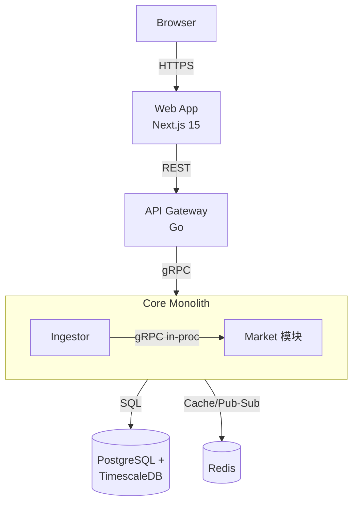

# GPAI 架构概览

> 详细设计见 [骨架阶段 spec](../superpowers/specs/2026-06-22-gpai-stock-platform-skeleton-design.md)。

## 运行时拓扑

```mermaid
flowchart TB
  Browser -->|HTTPS| Web[Web App<br/>Next.js 15]
  Web -->|REST| Gateway[API Gateway<br/>Go]
  Gateway -->|gRPC| Core[Core Monolith<br/>Rust]
  Core -->|SQL| PG[(PostgreSQL +<br/>TimescaleDB)]
  Core -->|Cache/Pub-Sub| Redis[(Redis)]

  subgraph Core [Core Monolith]
    Market[Market 模块]
    Ingestor[Ingestor]
  end

  Ingestor -->|gRPC in-proc| Market
```

## 仓库布局

参见 spec §2.2。